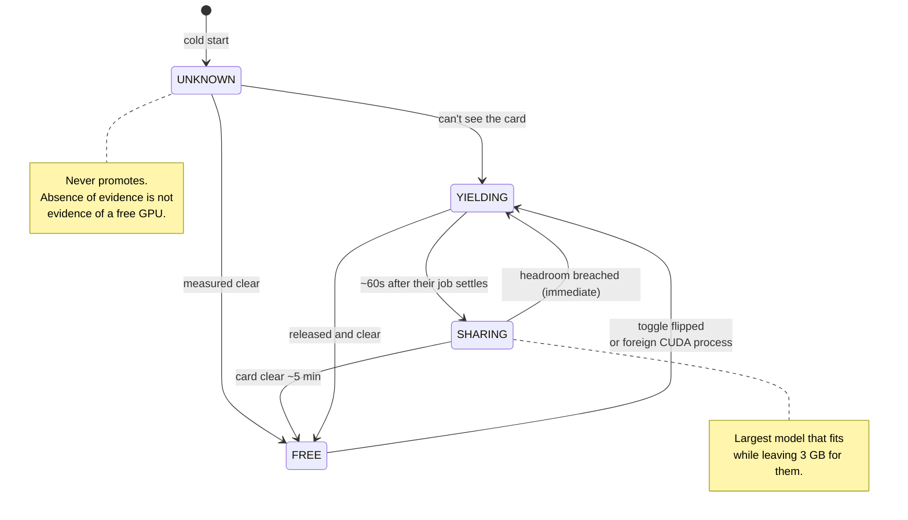
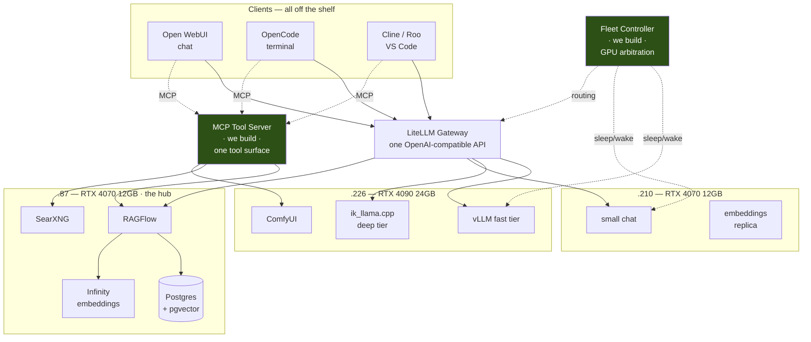
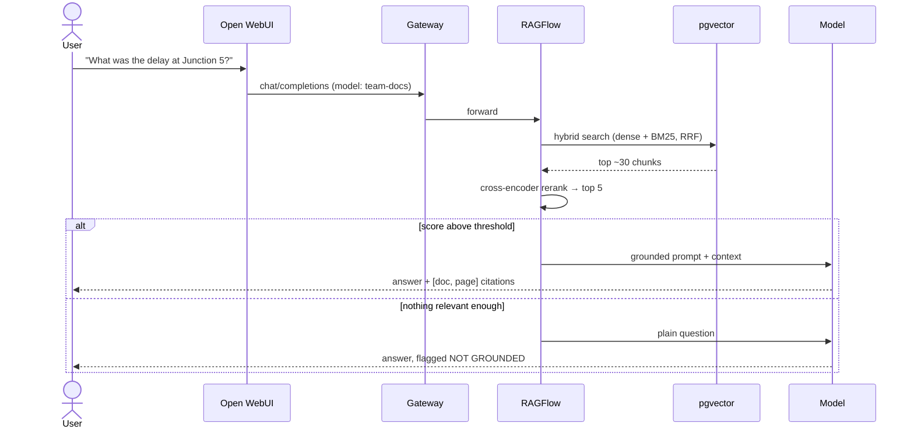
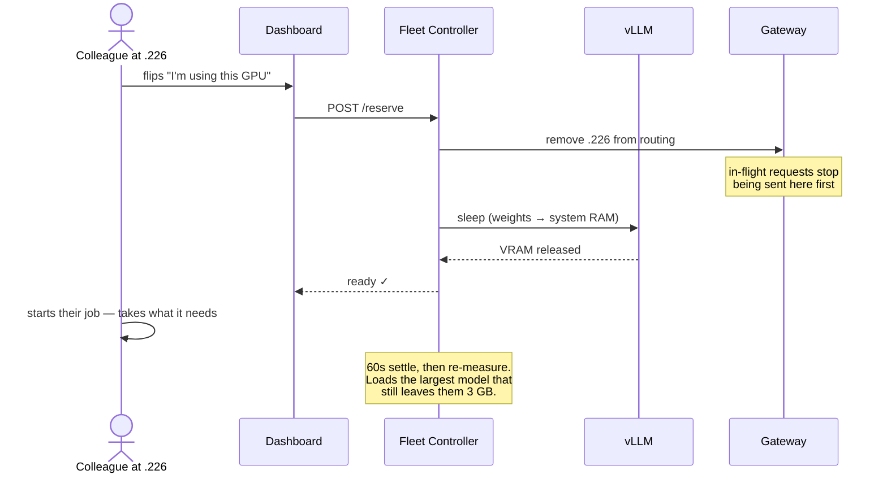
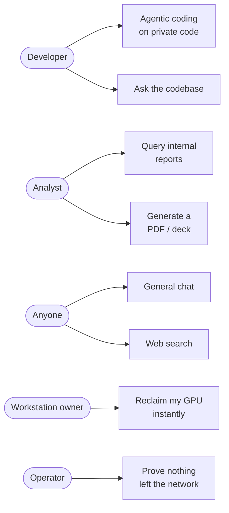

# Understudy

**A self-hosted AI platform that runs on the GPUs your team isn't using — and gets out of the way the moment they are.**

Chat, agentic coding, document RAG with citations, web search, and PDF/PPTX/image generation.
All on local open-weight models. No paid services. No document ever leaves your network.

> **Why "Understudy"?** An understudy performs when the stage is free and steps aside the instant
> the principal returns. That is the single most distinctive property of this system: it lives on
> four workstations that people use for their real work every day, and its first duty is to be
> unnoticeable to them.

---

| | |
|---|---|
| **Status** | Design complete · Core services built · Hardware validation (M0) not started |
| **Tests** | 373 passing · `ruff` clean · `mypy --strict` clean |
| **Stack** | Python 3.11 · FastAPI · vLLM · Postgres+pgvector · Docker Compose |
| **Scale** | 10 seats · 4 GPU workstations · 64 GB VRAM · 512 GB RAM |
| **Cost** | Zero recurring |

---

## The problem

A team working with confidential documents has three bad options:

1. **Use a hosted assistant.** Fast and excellent — but the documents leave the building, and the
   bill scales with every seat.
2. **Do without.** Give up the productivity entirely.
3. **Self-host.** Correct in principle, except the obvious version needs a dedicated GPU server
   nobody has budgeted for.

Understudy takes a fourth path: **the GPUs already exist.** They sit in workstations that run
long-running simulation jobs — mostly CPU-bound, mostly idle on the GPU, and never all busy at once.
That is a fleet, if you are willing to be a polite guest on it.

The engineering problem is therefore not "how do we serve a model." It is:

> **How do you run a shared service on machines whose owners have absolute priority, without ever
> being the reason someone's eight-hour job died?**

Everything distinctive in this codebase follows from that question.

---

## What it does

| Capability | How |
|---|---|
| **Chat** | Open WebUI over a local model catalog, with accounts and history |
| **Agentic coding** | OpenCode in the terminal, Cline/Roo in VS Code — both on local models |
| **Document RAG** | Upload documents, ask questions, get answers **with page citations** |
| **Honest refusal** | When the answer isn't in your documents, it says so instead of guessing |
| **Web search** | Self-hosted SearXNG, so answers aren't frozen at the model's training cutoff |
| **Generation** | PDF (Typst), PPTX (python-pptx), images (ComfyUI + FLUX.1-schnell) |
| **Model choice** | Users pick speed vs quality per task, from fast to near-frontier |

---

## The core idea: the platform is a guest

Most GPU-sharing systems assume the scheduler owns the hardware. Here the **person sitting at the
machine owns it**, and the platform runs on the remainder.



Three rules make it work:

- **One inequality governs everything.** `footprint + headroom <= measured free VRAM`. Not a
  lookup table — a rule, defined in exactly one place.
- **Headroom is asymmetric.** 1 GB when the card is idle, 3 GB when sharing. A smaller model is an
  inconvenience; someone's run dying at hour six is not.
- **Every ambiguity yields more, never less.** An unparseable reading, a failed unload, an
  unreachable host — all resolve toward giving VRAM back.

And it is **removable in one command per host.** Nothing it does leaves a machine worse than it
found it. That property is what makes it politically possible to install on a colleague's workstation.

---

## Architecture



**We build three things.** Everything else is assembled from mature open source — because the
differentiated value is *our documents on our network*, not a chunker we wrote ourselves.

| We build | Why nothing off the shelf does it |
|---|---|
| **Fleet controller** | GPU arbitration against a specific social contract on specific shared machines |
| **MCP tool server** | One tool surface for three clients — 5 integrations instead of 15 |
| **Per-host agent** | Reports `nvidia-smi` across the network |

---

## The fleet

| Host | GPU | VRAM | RAM | Role |
|---|---|---|---|---|
| `.226` | RTX 4090 | 24 GB | **256 GB** | Fast tier, deep tier, image generation |
| `.87` | RTX 4070 | 12 GB | 128 GB | **The hub** — data, gateway, our services |
| `.210` | RTX 4070 | 12 GB | 96 GB | Overflow + embeddings failover |
| `.149` | RTX 5080 | 16 GB | 32 GB | *Deferred — not on the critical path* |

`.226`'s **256 GB of 8-channel DDR5** is the fleet's most valuable asset — more than the 4090 beside
it. It is what lets a 235B-parameter MoE run with its experts in system RAM, which is the only route
to near-frontier quality on hardware we already own.

### Model tiers

| Tier | Model | Speed | Quality |
|---|---|---|---|
| **Fast** | Qwen3-Coder-30B-A3B Int4 | 60–85 tok/s | Good; clearly below frontier |
| **Deep** | Qwen3-235B-A22B Q4 (RAM-resident experts) | 10–20 tok/s | Near-frontier |

Fast for iterating. Deep for the things worth waiting for. We are honest about the gap rather than
pretending it away.

---

## How it works

### Asking a question about your documents



That `else` branch is the product. An assistant that invents a citation is worse than one that
admits ignorance — **one citation caught pointing at the wrong page discredits every correct one**.

### Claiming a GPU



The **`ready`** signal is the whole point. Nobody should have to guess whether the VRAM is actually
free — it is a measured fact, not an acknowledgement.

---

## Use cases



| Actor | Needs | Served by |
|---|---|---|
| Developer | Code help without code leaving the building | OpenCode / Cline on local models |
| Analyst | Answers from internal documents, with sources | RAG + citations + refusal |
| Anyone | A capable assistant, current on the world | Chat + web search |
| **Workstation owner** | **Their machine back, now** | **Toggle → ready in ~10 s** |
| Operator | Provable confidentiality | Egress capture test (N1) |

---

## Repository layout

```
understudy/
├── docs/                      Design record — 21 documents + ADRs
│   ├── 00-goals-and-constraints.md    Requirements with acceptance criteria
│   ├── 03-gpu-sharing-policy.md       The social contract, in detail
│   ├── 04-m0-spikes.md                Measurements that gate everything
│   ├── ports.md                       Authoritative port allocation
│   └── adr/                           7 architecture decision records
├── services/
│   ├── fleet-controller/      GPU arbitration (models, ladder, state, actuators, loop)
│   └── mcp-tools/             Five tools, one surface
├── deploy/                    Per-host compose stacks + fleet.yaml
└── scripts/                   M0 spike toolkit
```

---

## Getting started

**Prerequisites:** four Windows hosts with WSL2 + Ubuntu, NVIDIA GPUs, Docker, and `uv`.

```bash
# development machine
git clone <repo> && cd understudy
uv sync --all-packages --group dev
uv run pytest -q                       # 373 tests, no GPU required

# on a host, before anything else
uv sync --all-packages --group spikes  # ~2.5 GB CUDA torch
uv run scripts/spike_01_vram.py --json results/spike01-$(hostname).json
```

**Start with [`docs/04-m0-spikes.md`](docs/04-m0-spikes.md).** Seven measurements with pass/fail
gates. Two of them can invalidate the model ladder outright, which is exactly why they come first.

---

## Development

The services are network-bound, so they develop and test **entirely off-host** — no GPU needed,
which is fortunate, because the workstations run no SSH.

```bash
make setup     # dev dependencies
make test      # pytest
make lint      # ruff + mypy --strict
make deploy HOST=87
```

Every external dependency has a fake: `FakeSampler`, `FakeActuator`, `httpx.MockTransport`. That is
not tidiness — it is the only way any of this logic is exercised before it first runs on `.226`.

---

## Documentation

| Read this | For |
|---|---|
| [`docs/00-goals-and-constraints.md`](docs/00-goals-and-constraints.md) | Requirements, measurable acceptance criteria, non-goals |
| [`docs/01-architecture.md`](docs/01-architecture.md) | Component map and the three load-bearing decisions |
| [`docs/03-gpu-sharing-policy.md`](docs/03-gpu-sharing-policy.md) | The sharing contract and its eight acceptance tests |
| [`docs/tech-stack.md`](docs/tech-stack.md) | Every choice, its tradeoffs, and **licence traps** |
| [`docs/delivery-plan.md`](docs/delivery-plan.md) | Milestones, host bring-up order, rollback |
| [`docs/adr/`](docs/adr/) | Why each decision was made, and what was rejected |

---

## Roadmap

| | Milestone | State |
|---|---|---|
| **M0** | Hardware spikes — measure before committing | **Next** |
| M1 | Chat online — the team can log in | Blocked on M0 |
| M1.5 | RAGFlow spike — adopt retrieval or build it | |
| M2 | Coexistence — the toggle, the ladder, `gpu-run` | |
| M3 | Coding agents | |
| M4 | Deep tier via CPU offload | |
| M5 | RAG with citations | |
| M6 | Tools — search, PDF, PPTX, image | |
| M7 | Hardening — backups, monitoring, egress proof | |

---

## Non-goals

Stated so nobody adds them later:

- **No frontier-parity claim.** Open weights trail the closed frontier. We get close on the deep
  tier and say so plainly.
- **No guaranteed uptime.** These are workstations, not servers. Best-effort by design.
- **No adversarial scheduling.** Colleagues, not attackers. A cooperative system is the right amount
  of engineering here.
- **No distributed inference.** 1 GbE is three orders of magnitude short of what that needs.
- **No public exposure.** LAN and VPN only.

---

## Security

- **Documents and code never leave the network.** Only self-hosted SearXNG has an egress route, and
  only for search queries. Enforced at the network layer (`internal: true`), not by convention.
- **Verified, not asserted.** The N1 test seeds canary strings, blocks egress, captures traffic, and
  requires a positive control so a broken capture cannot masquerade as a pass.
- **No credentials in this repository.** `.env` is gitignored; `make secrets-scan` checks what would
  actually be committed.

---

## Licence

**Apache-2.0** — see [LICENSE](LICENSE). Chosen over MIT for its explicit patent grant, which
matters if another organisation adopts this.

Every dependency is open source and commercially usable. Two traps we hit and avoided, documented in
[`docs/tech-stack.md`](docs/tech-stack.md) §8:

- **FLUX.1-dev is non-commercial** → we use FLUX.1-schnell (Apache-2.0)
- **PyMuPDF is AGPL-3.0** → we use pypdfium2 / pdftext (Apache-2.0)
